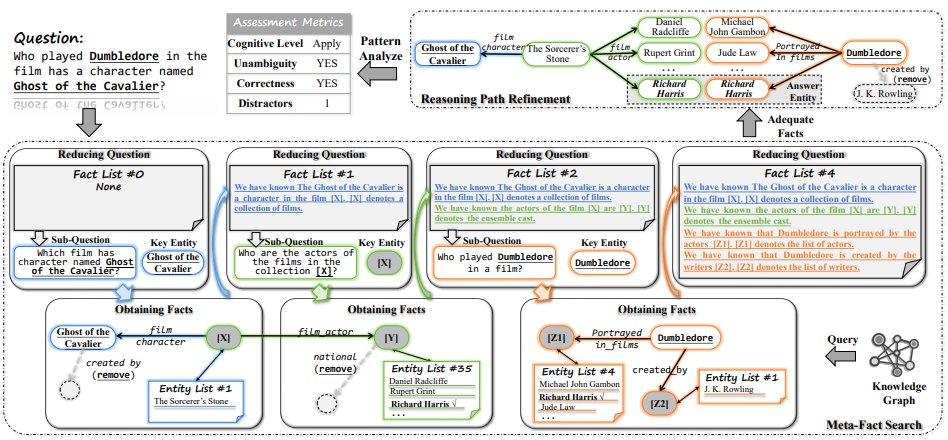

# The pipeline of MFC:



# Project Structure
- `requirements.txt`: Pip environment file.
- `data/`: Evaluation datasets.
- `cot_io/`: CoT methods and IO methods.
- `eval/`: Evaluation script.
- `MFC/`: Source codes.
  - `main.py`: The main file of MFC where Freebase as KG source.
  - `prompt.py`: The prompts for model to pruning, reasoning and generating.
  - `func.py`: All the functions used in `MFC/`.
  - `process.py`: Process the json file generated by `main.py`.
  - `process2.py`: Process the json file generated by `process.py`.
  - `utils.py`: All the functions used in `MFC/`.
  - `get_answer.py`: Generate the answer.
  - `get_path.py`: Generate the path.

# dataset
We use four main datasets, including **CWQ**, **GrailQA**, **SimpleQA**, and **WebQSP**, for testing the QA capabilities of our framework MFC.
Also, the **CWQ-QQA** dataset, which is based on the CWQ dataset, is labeled from the four perspectives **cognitive level**, **unambiguity**, **correctness**, and **distractors**. CWQ-QQA is used for QA as well as for the task of question quality assessment. 

# Get started
Before running, please ensure that you have successfully installed **Freebase** on your local machine.
The required libraries for running MFC can be found in `requirements.txt`.

## How to install **Freebase**
- OpenLink Virtuoso 7.2.5 (download from this public [link](https://sourceforge.net/projects/virtuoso/files/virtuoso/))
- Python 3
- Freebase dump from this public [link](https://developers.google.com/freebase?hl=en)
### Data Preprocessing
We use this py script (public [link](https://github.com/lanyunshi/Multi-hopComplexKBQA/blob/master/code/FreebaseTool/FilterEnglishTriplets.py), to clean the data and remove non-English or non-digital triplets:
```sh
gunzip -c freebase-rdf-latest.gz > freebase # data size: 400G
nohup python -u FilterEnglishTriplets.py 0<freebase 1>FilterFreebase 2>log_err & # data size: 125G

you also can clean the data without gunzipping:
zcat freebase-rdf-latest.gz | python FilterEnglishTriplets.py | gzip > freebase-filter.gz # 10G
```
### Import data
We import the cleaned data to virtuoso,
```sh
tar xvpfz virtuoso-opensource.x86_64-generic_glibc25-linux-gnu.tar.gz
cd virtuoso-opensource/database/
mv virtuoso.ini.sample virtuoso.ini

# ../bin/virtuoso-t -df # start the service in the shell
../bin/virtuoso-t  # start the service in the backend.
../bin/isql 1111 dba dba # run the database

Here are two solutions to import:
# 1、unzip the data and use rdf_loader to import
SQL>
ld_dir('.', 'FilterFreebase', 'http://freebase.com'); 
rdf_loader_run();

# 2、use DB.DBA.TTLP_MT to import
SQL>
DB.DBA.TTLP_MT (gz_file_open ('freebase-filter.gz'), '', 'http://freebase.com', 128);
```

## How to run
Upon successfully installing all the necessary configurations, you can proceed to execute MFC directly by employing the following command:

```sh
#First, you should run main.py to get a json file without processing.
python main.py

#Then, you should run process.py for unprocessed json files generated by main.py. 
#Where process.py is replacing all entity ids in the unprocessed file with entity labels. 
python process.py

#process2.py generates answers as cot for questions without retrieved paths and extracts all questions with retrieved paths.
#So you also need to run process2.py, if you have finished running process.py
python process2.py

#Run get_answer.py and get the answer.
python get_answer.py

#Run get_path.py and get the complete path.
python get_path.py
```

## How to eval
Upon obtaining the result file, such as `answer.json`,you just need to use the script `eval/eval.py`.

After getting the final result file, use the following command to evaluate the results:

```sh
python eval.py
```

After that, the result will be printed in the form below:

```sh
true: correct amount
error: incorrect amount
total: total amount
```

# Experiment:

Table 1: EM score on multi-hop reasoning. The fine-tuned state-of-the-art (SOTA) models provide references that are evaluated using the entire validation sets, rather than on the subsets.


Table 2: F1 scores of proposed metrics on CWQ-QQA.


# Citation
If you find this work useful, please cite the following paper:
```
@inproceedings{zhang2025what,
  title={What is a Good Question? Assessing Question Quality via Meta-Fact Checking},
  author={Zhang, Bo and Zhu, Jianghua and Li, Chaozhuo and Yu, Hao and Kong, Li and Wang, Zhan and Miao, Dezhuang and Zhang, Xiaoming and Zhou, Junsheng},
  booktitle={Proceedings of the AAAI conference on artificial intelligence},
  year={2025}
}
```
